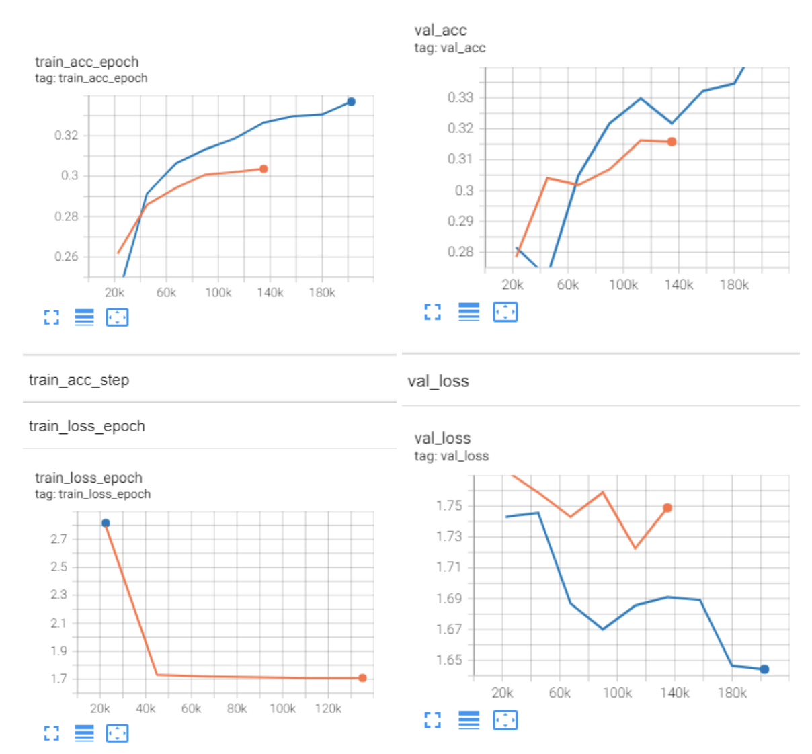

# DL Voice Classification
> This project contains the code for our Deep Learning project on age classifcation from voice input.

## Introduction

Being able to extract certain background information about the users, such as their age, can be useful in numerous ways including user-profiling and personalised call-routing. With this knowledge, one possible application of speech recognition age classifiers is a recommendation system that can return an age-relevant result when asked for a movie recommendation. This enhances the quality of recommendation since a popular movie for the general audience could be an irrelevant movie to a child requesting for a children’s show with a similar title

## Problem Statement - Age Classification from Voice Samples

In this project we have thus experiemented with multiple neural network architectures to train an age classifier from voice recording samples. They range from vanilla Recurrent Neural Networks (RNNs), Bidirectional Gated Recurrent Units (Bidirectional GRUs), Temporal Convolutional Neural Networks (TCNs), and vanilla Convolutional Neural Networks (CNNs). We have found the most success using vanilla CNNs with an accuracy of 35%.

## Dataset used

The dataset to be used is found in [Common Voice](https://commonvoice.mozilla.org/en/datasets), a database for speech recognition software by Mozilla. The specific version used is Common Voice Corpus 8.0, with the audio language set to English. This particular dataset is 70 GB large and consists of 79,398 Voices (with about 20GB of 450,000 files after cleaning and removing 75% of the raw input files) in MP3 format, with the breakdown of each age group as follows before data cleaning:
| Age Group | < 19 | 20-29 | 30-39 | 40-49 | 50-59 | 60 -69 | 70-79 | 80 -89| >90|
| ---------------------- | ---- | ----- | ----- | ----- | ----- | ---- |---- |---- |---- |
| Percentage in Dataset | 6% | 24% | 13% | 6%| 9%| 4%| 1%| ~0%| ~0%|

The breakdown of each age group after data cleaning is as follows:
| Age Group | < 19 | 20-29 | 30-39 | 40-49 | 50-59 | > 60|
| ---------------------- | ---- | ----- | ----- | ----- | ----- | ----|
| Percentage in Dataset | 16.7% | 16.7% |16.7% |16.7%| 16.7%| 16.7%|

## Final Model - Convolutional Neural Network (CNN)

Among the models we have experimented with, the model that produced the highest accuracy (35%) was a CNN with a feature learning block (FLB) consisting of convolution, pooling, and batch normalisation layers. Convolution layers extract local and global high level features whereas pooling layers decrease processing time by reducing the dimensionality of feature maps. We wanted to arrange the layers in a way that builds robust and salient feature maps.

For the first convolutional layer, a **kernel size of 3x3 and stride 2** was used. ReLU was then used as the activation function in this layer as well as all other convolutional layers to generalise the model to achieve better performance during training. **Batch normalisation** was then performed, followed by **max pooling with a kernel size and stride of 2x2**. For the second convolutional layer, **a kernel size of 5x5 with stride 1x1** was used. **Max pooling was performed again with a kernel size of 2x2 and stride 1x1**. Finally, for the third convolutional layer, a **kernel size of 2x2 and stride 1x1** was used, and another round of batch normalisation was conducted before finally parsing its output into a fully connected layer for the final output.

### Results

Here we can see that both the training and validation accuracy achieving 35% accuracy


## How to train the models

1. Upload the jupyter notebook you want to run to your Google drive.

2. Add the path of the folder containing the notebook to the code below.
    ```
    # Change this your path to the gdrive
    pwd = "/content/drive/MyDrive/Deep Learning/"
    ```
3. Connect to a GPU runtime and run the next block of code to download the dataset.
    ```
    !wget "https://drive.google.com/uc?id=1MKzu-TfLKEygWOK5FpbVBsI8sKeB48DC&confirm=t"
    !mv "uc?id=1MKzu-TfLKEygWOK5FpbVBsI8sKeB48DC&confirm=t" root_audio_dir.zip
    !wget "https://drive.google.com/uc?export=download&id=1v0zhoVKLCSudS4XJFJHR3GWN28B5zdBB"
    !mv "uc?export=download&id=1v0zhoVKLCSudS4XJFJHR3GWN28B5zdBB" formatted.csv
    csv_file_path = "formatted.csv"
    root_audio_dir = "root_audio_dir/"
    ```
    Alternatively, if the above fails, proceed to our [google drive folder](https://drive.google.com/drive/folders/196KRvyUlmY05-hxnRYhLqB8B34eCLUel?usp=sharing) and transfer the `root_audio_dir.zip` file to the same directory of the notebook.
    
4. Unzip and remove the zip file.
    ```
    !unzip -q root_audio_dir.zip
    !rm root_audio_dir.zip
    !du -sh ./*
    ```
    
5. Run the remainder code cells.

### For ProjectCode_Riley.ipynb only

1. Run the code all the way till the **Define RNN/Bidirectional GRU** section. 
2. Specify the model you want to train 
    ```
    # If you want to use RNN, specify "RNN" instead of "BiGRU"
    model_name = "BiGRU"
    ```

## Training Features

### Callbacks

- Early stopping
- Model checkpoints

Early stopping is implemented so that we can stop training before the model starts to overfit. Meanwhile model checkpoint is needed as the runtime that Colaboratory provides is unreliable, hence we would want to save our model periodically so that we can restore training from the previous checkpoint.

```
earlystopping_cb = EarlyStopping(monitor="val_loss", mode="min", patience=4)
modelckpt_cb = ModelCheckpoint(monitor="val_loss", dirpath=model_save_path, filename=model_name+"_{epoch}_{val_loss:.2f}")
```

### Tensorboard

You can use the tensorboard to track the performance of the model while training. The tensorboard will show the validation performance of your model at every epoch.
```
# Launch tensorboard
%reload_ext tensorboard
%tensorboard --logdir=lightning_logs/
```

### Pytorch Lightning Training 

To train the model, run this block of code. For every epoch, a validation will be performed on the model. You can refresh the tensorboard to see the validation results and find out how your model is performing. 
```
trainer = pl.Trainer(gpus=1, callbacks=callbacks, max_epochs=epochs, check_val_every_n_epoch=1)
trainer.fit(model, train_loader, val_loader)
```
Avoid running the training for too many epochs as you might hit the Colab usage limits.

### Saving your Model

Run this block of code to save your model as a `.pth` file
```
# Manual saving
torch.save(model.model.state_dict(), "testing_model.pth")  # Can replace with model_name
```

### Testing 

After training, run your model against the test set. You will be able to see the accuracy and loss of your model once it's done.
```
trainer.test(model, test_loader)
```

## Getting Model Predictions through our GUI

You can also let our trained CNN model guess your age from your voice! 

To do this, access our GUI by clicking on the Binder badge below:

[](https://mybinder.org/v2/gh/sqiyan/DLvoiceclassification/HEAD?filepath=Project_Code_for_GUI.ipynb)

Note that our model accuracy is about 35%.. so don't be too offended by a wrong classification!

### How it works

1. We load our model file from the repository into a PyTorch model that has been defined with the same architecture
2. We initialise an audio recorder widget to record your audio via your device's microphone input
3. The audio input is then converted to a .wav file and passed into our model for prediction

Also, should the Jupyter Notebook on Binder have issues with displaying our audio recorder widget, here is what it is supposed to look like:


#
Credits to Toh Kai Feng, Yap Swee En, Chua Qi Bao, Seah Qi Yan, Lo Jun Kai
